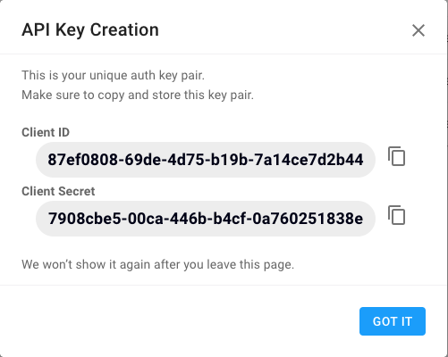

# Connecting to your environment

In this step we will make sure that you are abile to connect to your [_StackPulse_](https://app.stackpulse.io) environment and to create and execute new _playbooks_.

## Log in to your StackPulse account

Go head, open a new Browser tab/window and navigate to:

`https://app.stackpulse.io`

## Generate API Keys

To perform actions on your behalf in your _StackPulse_ account during this tutorial, we will need a set of StackPulse API Key / Secret.

To do that:

1. Click on an icon with your user avatar (at the bottom of the left-hand-side navigation bar in the _StackPulse portal_).

2. Choose `API Keys` and click on `New Key`

3. Come up with a name for your key pair - something that will help you remember what it is used for, such as `intro_course_stackpulse_academy`

4. You will see a dialog similar to the below (the IDs will be, of course, different):

   

5. Copy the Client ID and Client Secret for future use.

## Initialize Communication with StackPulse

In the terminal window to the right type:

`stackpulse init`{{execute}}

And provide the Client ID and Client Secret.

To verify that the environment is operational run
`stackpulse get playbooks`{{execute}}

 