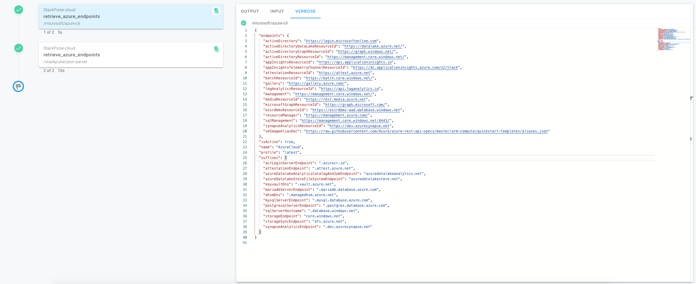

# First Playbook


Lets create a playbook that will perform the following operations:

1. Retrieve information about Endpoints of an Azure Cloud Service (using a dedicated command)
2. Take specific Endpoints and print them out to playbook output


## Playbook Header


Every playbook file begins with a "playbook header". Go ahead, switch to the `IDE` and click on  `multi_steps_playbook.yaml`{{open}}  to start editing.

Now click on the below to create the playbook:

<pre class="file" data-filename="multi_steps_playbook.yaml" data-target="replace">apiVersion: stackpulse.io/v1
kind: Playbook
metadata:
  name: multi_steps_playbook
  description: "Tutorial for creating a first multiple-steps playbook"
steps:
</pre>


## First step

As we mentioned, out first step is to retrieve an information about external services. In this particular example, we will use Microsoft Azure step to retrieve information about Endpoints of an Azure Cloud.


Go ahead, add the below step to your playbook:

<pre class="file" data-filename="multi_steps_playbook.yaml" data-target="append">    - name: microsoft/azure-cli
      id: retrieve_azure_endpoints
      args:
        - az
        - cloud
        - show
      output_parser:
        name: us-docker.pkg.dev/stackpulse/public/json-parser
</pre>

As you can see, we are using a generic `Azure CLI` container to make a call to Microsoft Azure API and retrieve information. Naturally, this is just an example, and any other operation retrieving information that might be required in another step of the process can come in its stead.

(Please note, that this step using the `output_parser` annotation because it uses a generic container, rather than a specific _StackPulse Step_. For more information on output parsers please refer to [StackPulse Documentation](https://docs.stackpulse.io/playbooks/#processing-step-output))

Now, lets try to execute the playbook containing this step in order to familliarize ourselves with how the output looks:

Please run the following commands in the terminal:

`./stackpulse apply playbook -f multi_steps_playbook.yaml`{{execute}}

If the operation is successful, a message similar to the below (albeit with a different ID) should be shown:

```bash
created "multi_steps_playbook" id="b351a757-92cb-44d0-942e-36828f8144ec"
```


To trigger an execution of your playbook, please run:
`./stackpulse run playbook multi_steps_playbook`{{execute}}

If the operation is successful, you will see an output similar to the below:

```bash
Running Playbook multi_steps_playbook

Execution: https://app.stackpulse.io/execution/d5b69ca7-d935-4be4-ba78-d87c09d044fe
```

Do a `Command+Click`/`Ctrl+Click` on the URL to see the execution results.

## Understanding step output


After opening the execution in _StackPulse Portal_, please note the _Verbose_ step output containing the data retrieved:


This is the data structure returned by our first step:

```json
{
  "endpoints": {
    "activeDirectory": "https://login.microsoftonline.com",
    "activeDirectoryDataLakeResourceId": "https://datalake.azure.net/",
    "activeDirectoryGraphResourceId": "https://graph.windows.net/",
    "activeDirectoryResourceId": "https://management.core.windows.net/",
    "appInsightsResourceId": "https://api.applicationinsights.io",
    "appInsightsTelemetryChannelResourceId": "https://dc.applicationinsights.azure.com/v2/track",
    "attestationResourceId": "https://attest.azure.net",
    "batchResourceId": "https://batch.core.windows.net/",
    "gallery": "https://gallery.azure.com/",
    "logAnalyticsResourceId": "https://api.loganalytics.io",
    "management": "https://management.core.windows.net/",
    "mediaResourceId": "https://rest.media.azure.net",
    "microsoftGraphResourceId": "https://graph.microsoft.com/",
    "ossrdbmsResourceId": "https://ossrdbms-aad.database.windows.net",
    "resourceManager": "https://management.azure.com/",
    "sqlManagement": "https://management.core.windows.net:8443/",
    "synapseAnalyticsResourceId": "https://dev.azuresynapse.net",
    "vmImageAliasDoc": "https://raw.githubusercontent.com/Azure/azure-rest-api-specs/master/arm-compute/quickstart-templates/aliases.json"
  },
  "isActive": true,
  "name": "AzureCloud",
  "profile": "latest",
  "suffixes": {
    "acrLoginServerEndpoint": ".azurecr.io",
    "attestationEndpoint": ".attest.azure.net",
    "azureDatalakeAnalyticsCatalogAndJobEndpoint": "azuredatalakeanalytics.net",
    "azureDatalakeStoreFileSystemEndpoint": "azuredatalakestore.net",
    "keyvaultDns": ".vault.azure.net",
    "mariadbServerEndpoint": ".mariadb.database.azure.com",
    "mhsmDns": ".managedhsm.azure.net",
    "mysqlServerEndpoint": ".mysql.database.azure.com",
    "postgresqlServerEndpoint": ".postgres.database.azure.com",
    "sqlServerHostname": ".database.windows.net",
    "storageEndpoint": "core.windows.net",
    "storageSyncEndpoint": "afs.azure.net",
    "synapseAnalyticsEndpoint": ".dev.azuresynapse.net"
  }
}
```


