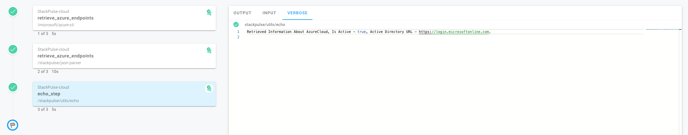

# Taking output of previous step


Previously we have created a step that calls an external component (in our particular case,  Azure API) and retrieves some information. Now we will create an additional step in the playbook that will take parts of the information retrieved by the previous step and use them. We will use a simple step that will only print these parts in the step output.


As previously seen, `retrieve_azure_endpoints` step is returning the following structure:

```json
{
  "endpoints": {
    "activeDirectory": "https://login.microsoftonline.com",
    "activeDirectoryDataLakeResourceId": "https://datalake.azure.net/",
    "activeDirectoryGraphResourceId": "https://graph.windows.net/",
    "activeDirectoryResourceId": "https://management.core.windows.net/",
    "appInsightsResourceId": "https://api.applicationinsights.io",
    "appInsightsTelemetryChannelResourceId": "https://dc.applicationinsights.azure.com/v2/track",
    "attestationResourceId": "https://attest.azure.net",
    "batchResourceId": "https://batch.core.windows.net/",
    "gallery": "https://gallery.azure.com/",
    "logAnalyticsResourceId": "https://api.loganalytics.io",
    "management": "https://management.core.windows.net/",
    "mediaResourceId": "https://rest.media.azure.net",
    "microsoftGraphResourceId": "https://graph.microsoft.com/",
    "ossrdbmsResourceId": "https://ossrdbms-aad.database.windows.net",
    "resourceManager": "https://management.azure.com/",
    "sqlManagement": "https://management.core.windows.net:8443/",
    "synapseAnalyticsResourceId": "https://dev.azuresynapse.net",
    "vmImageAliasDoc": "https://raw.githubusercontent.com/Azure/azure-rest-api-specs/master/arm-compute/quickstart-templates/aliases.json"
  },
  "isActive": true,
  "name": "AzureCloud",
  "profile": "latest",
  "suffixes": {
    "acrLoginServerEndpoint": ".azurecr.io",
    "attestationEndpoint": ".attest.azure.net",
    "azureDatalakeAnalyticsCatalogAndJobEndpoint": "azuredatalakeanalytics.net",
    "azureDatalakeStoreFileSystemEndpoint": "azuredatalakestore.net",
    "keyvaultDns": ".vault.azure.net",
    "mariadbServerEndpoint": ".mariadb.database.azure.com",
    "mhsmDns": ".managedhsm.azure.net",
    "mysqlServerEndpoint": ".mysql.database.azure.com",
    "postgresqlServerEndpoint": ".postgres.database.azure.com",
    "sqlServerHostname": ".database.windows.net",
    "storageEndpoint": "core.windows.net",
    "storageSyncEndpoint": "afs.azure.net",
    "synapseAnalyticsEndpoint": ".dev.azuresynapse.net"
  }
}
```


All of the information returned by playbook steps can be made available to consequent steps by accessing the _shared playbook execution context_ via _templates_. For a detailed explanation on the execution context please refer to [StackPulse Documentation](https://docs.stackpulse.io/playbooks/#variables-and-templates). 

Each _field_ in the output above can be accessed in two ways:

* Explicitly, using the step id, i.e. `$.retrieve_azure_endpoints.name` (that will return "AzureCloud")
* Implicitly via the global namespace, i.e. `$.name`

The main difference between the two approaches, is that, using an explicit syntax, we will always refer to the "name" field returned by the `retrieve_azure_endpoints` step, whereas with the implicit syntax, any subsequent step can also return a field called "name" and override the access to `$.name`.


Naturally, the access structure supports complex objects, allowing access to internal fields by providing a full path, i.e., `$.retrieve_azure_endpoints.endpoints.activeDirectory`.


## Using the information in step arguments


Now lets combine retrieving the information from a step output with providing it as arguments to the subsequent steps. Lets add the below step to our playbook:


<pre class="file" data-filename="multi_steps_playbook.yaml" data-target="append">    - id: echo_step
      name: us-docker.pkg.dev/stackpulse/public/utils/echo
      env:
        MESSAGE:   |
             Retrieved Information About {{ $.retrieve_azure_endpoints.name }},
             Is Active - {{ $.retrieve_azure_endpoints.isActive }},
             Active Directory URL - {{ $.retrieve_azure_endpoints.endpoints.activeDirectory }},
</pre>

We have used information provided by the `retrieve_azure_endpoints` step in an argument (environment variable - MESSAGE) of an `echo_step` step, creating a multiline string containing a number of fields retrieved from the step output. We used the _template annotation_ (`{{ ... }}`) to refer to these fields.

As previously, lets upload these changes by  runing the following commands in the terminal:

`./stackpulse apply playbook -f multi_steps_playbook.yaml`{{execute}}

If the operation is successful, a message similar to the below (albeit with a different ID) should be shown:

```bash
updated "multi_steps_playbook" id="b351a757-92cb-44d0-942e-36828f8144ec"
```


To trigger an execution of your playbook, please run:
`./stackpulse run playbook multi_steps_playbook`{{execute}}

If the operation is successful, you will see an output similar to the below:

```bash
Running Playbook multi_steps_playbook

Execution: https://app.stackpulse.io/execution/d5b69ca7-d935-4be4-ba78-d87c09d044fe
```

Do a `Command+Click`/`Ctrl+Click` on the URL to see the execution results.

(Please wait for the execution of all steps to be completed and click on the last step to see the _Verbose_ output):

 


